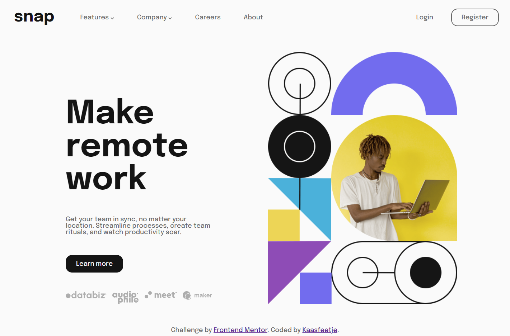
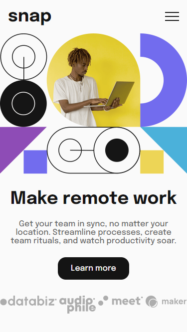
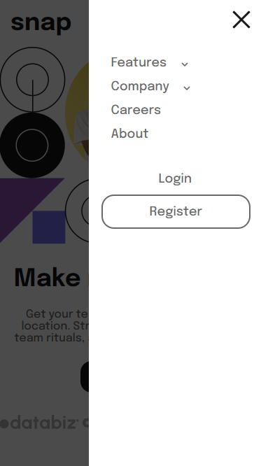
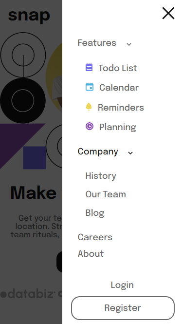

# Frontend Mentor - Intro section with dropdown navigation solution

This is a solution to the [Intro section with dropdown navigation challenge on Frontend Mentor](https://www.frontendmentor.io/challenges/intro-section-with-dropdown-navigation-ryaPetHE5). Frontend Mentor challenges help you improve your coding skills by building realistic projects.

## Table of contents

-   [Overview](#overview)
    -   [The challenge](#the-challenge)
    -   [Screenshot](#screenshot)
    -   [Links](#links)
-   [My process](#my-process)
    -   [Built with](#built-with)
    -   [What I learned](#what-i-learned)
    -   [Continued development](#continued-development)
    -   [Useful resources](#useful-resources)
-   [Author](#author)

## Overview

### The challenge

Users should be able to:

-   View the relevant dropdown menus on desktop and mobile when interacting with the navigation links
-   View the optimal layout for the content depending on their device's screen size
-   See hover states for all interactive elements on the page

### Screenshots

### Links

-   Solution URL: [Add solution URL here](https://github.com/Kaasfeetje/FrontendMentor-IntroSectionWithDropdownNavigation)
-   Live Site URL: [Add live site URL here](https://your-live-site-url.com)

## My process

This was my first ever frontend mentor challenge, so first I looked over the design files, readme and style guide. It was quite confusing at first, but I figured I'd just start. So that's what I did in src folder

I started with the navbar, at first I split it up with an extra div around the logo and the four links/dropdowns. Later I found out this was not a good idea since on mobile I wanted to seperate the logo from the links and authentication. So I grouped the links and authentication together and made sure the authentication had margin-left of auto, to push it as far to the left as it could.

To create the dropdowns I split the nav item in two divs: title and dropdown-list. The title is the part that gets displayed like the other nav items, and the dropdown list gets hidden. Unless the dropdown div gets the class "show" added, in which case the dropdown list gets displayed. On desktop it has position absolute(to not disturb the flow), on mobile it gets display block since it should disrupt the flow.

Getting the hero image to have a decent size was quite hard. I tried messing with width:30vw and stuff like that, but it often became to big on resize. So I settled for height:70vh, this looked like the size of the design pictures. The h1 was also tricky, I wanted it to break on the same word so I added that, but on mobile I wanted it not to break. So I learned you can disable a   tag by display none. The brand svg's flex wrap on desktop, but not on mobile.

### Built with

-   HTML
-   CSS
-   Javascript

### What I learned

I learned how frontend mentor works, it's quite cool.

But about this project specifically, I'd done most of the things required before. I did learn you can deactivate a   tag by display:none. I also learned how to make elements the same size as its neighboring element, by adding margin-top:auto. This is something I've often had troubles with, but now I know.

### Continued development

I want to focus on mobile first development on my next projects. I've gotten into a bad habit of starting with desktop, and want to get rid of it.

### Useful resources

-   [Make container size same as neighbor](https://wpbeaches.com/aligning-last-item-bottom-container-flexbox/) - This helped me make neighboring divs the same size.

## Author

-   Github - [Kaasfeetje](https://github.com/Kaasfeetje)
-   Frontend Mentor - [@Kaasfeetje](https://www.frontendmentor.io/profile/Kaasfeetje)
-   Twitter - [@veldhuisMax](https://www.twitter.com/veldhuisMax)
